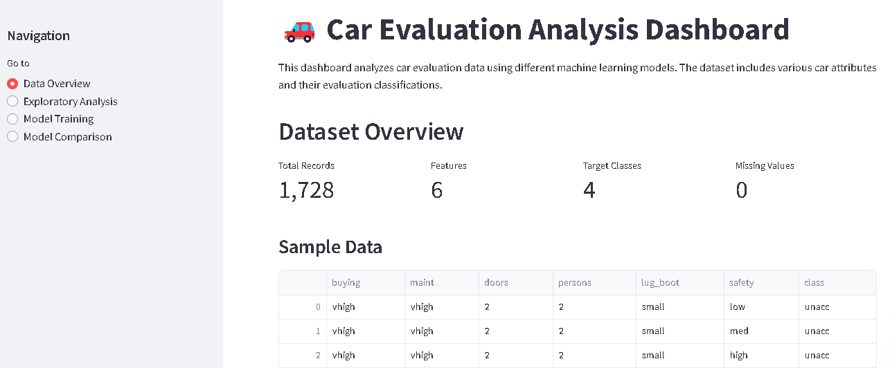
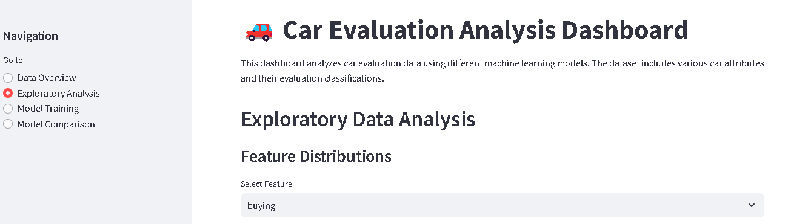
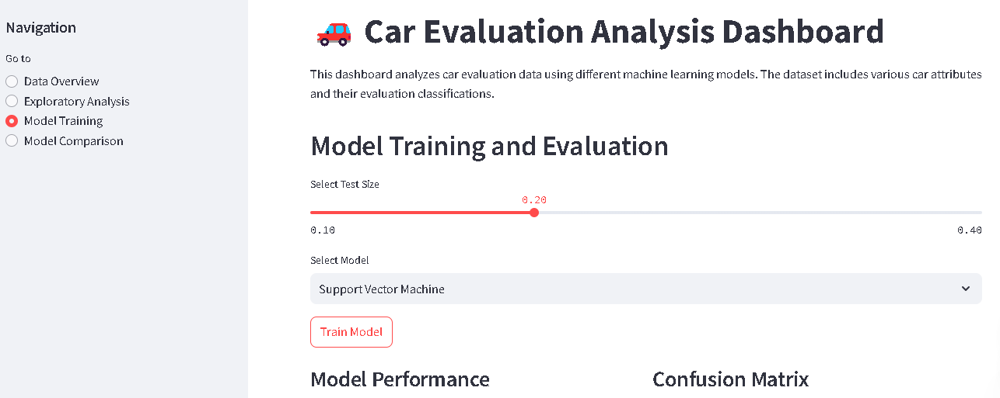

# Car Evaluation Analysis and Machine Learning Project

This repository contains a comprehensive analysis of the **UCI Car Evaluation Dataset**. The project includes exploratory data analysis (EDA), machine learning model training, and a **Streamlit app** for interactive exploration of the data and results. 

---

## Dataset Information

The dataset, sourced from the [UCI Machine Learning Repository](https://archive.ics.uci.edu/dataset/19/car+evaluation), evaluates the acceptability of cars based on several attributes:

- **Features:**
  - `buying`: Buying price (vhigh, high, med, low)
  - `maint`: Maintenance cost (vhigh, high, med, low)
  - `doors`: Number of doors (2, 3, 4, 5more)
  - `persons`: Passenger capacity (2, 4, more)
  - `lug_boot`: Size of luggage boot (small, med, big)
  - `safety`: Safety rating (low, med, high)
    
- **Target:**
  - `class`: Car acceptability categories (unacc, acc, good, vgood)

The dataset has 1,728 entries, all of which are complete (no missing values), and it is designed for classification tasks.

### Purpose:
The dataset is used to classify cars into different categories based on their features, which represent various car attributes such as price, safety, and passenger capacity.

This dataset is ideal for exploring classification algorithms like Decision Trees, Support Vector Machines (SVM), or Random Forest.

---

## Features of the Project

### Exploratory Data Analysis (EDA)
The EDA section provides insights into the dataset's structure, feature distributions, and relationships.

### Machine Learning Models
The following algorithms were implemented to classify car acceptability:
1. **Support Vector Machine (SVM)**
2. **Random Forest**
3. **Logistic Regression**

The project is divided into two main parts:
1. **Jupyter Notebook**: Used for data exploration, preprocessing, model training, and evaluation.
2. **Streamlit App**: Provides an interactive interface to visualize the results and classify cars based on user-inputted features.

---
## Files in the Repository

- **`car_evaluation.ipynb`**: Jupyter Notebook containing the data analysis and machine learning model training process.
- **`car_app.py`**: Streamlit application for interactive results exploration.

---

## Required Dependencies

This project requires the following Python libraries:

- `pandas` for data manipulation
- `numpy` for numerical computations
- `matplotlib` for data visualization
- `seaborn` for statistical data visualization
- `scikit-learn` for machine learning models and metrics
- `streamlit` for creating the interactive web app

---

## Getting Started

### Installation
1. Clone the repository:
   ```bash
   git clone https://github.com/csm34/CarEvaluation-ML-Algorithms.git
   cd CarEvaluation-ML-Algorithms
   ```
2. Launch the app locally with:
    ```bash
   streamlit run app.py
   ```
---

## Usage

1. Upon launching the Streamlit app, the main page will allow you to input car features (buying price, maintenance cost, etc.).
2. After inputting the features, the app will display the classification of the car (e.g., Acceptable, Good, etc.).
3. You can visualize the predictions and model performance interactively.

### Screenshots
#### Main Page


#### Exploratory Data Analysis


#### Machine Learning Model Training


---
## Licence
This project is open-source and available under the MIT License.
